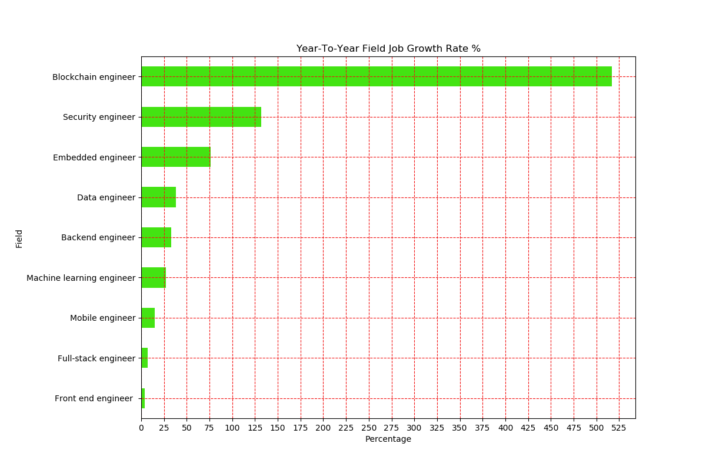
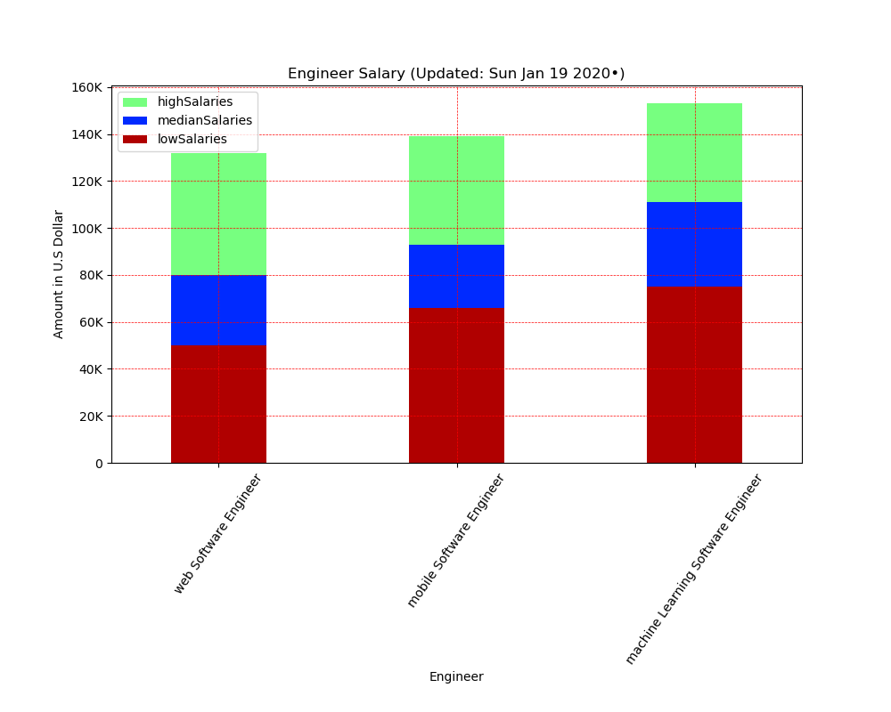
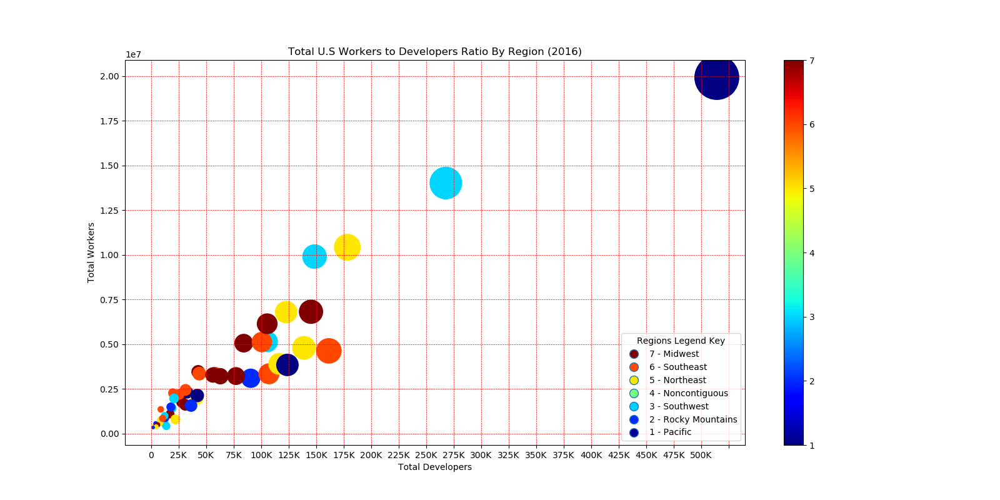

# Web_Data_Scraping

•	Performed web data scraping, organized data, formatted, and generated three cool graphs for analysis.

•	Running the code over again gets the most current information posted on the websites.

•	Code generates a “.png” file for each graph.

•	Code generates a “.csv” file for each graph as well.

